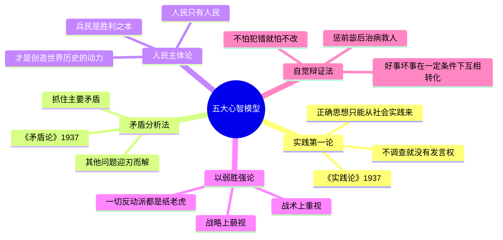

# 🧠 mao-skill — 毛泽东思维视角 AI Skill

<p align="center">
  
</p>

<p align="center">
  <strong>用毛泽东的认知框架、决策逻辑和表达方式来分析问题、做出判断、给出建议。</strong>
</p>

<p align="center">
  
  
  
  
  
</p>

<p align="center">
  <strong>GitHub</strong>: <a href="https://github.com/CochraneK/mao-skill">CochraneK/mao-skill</a> ·
  <strong>蒸馏日期</strong>: 2026年4月17日
</p>

---

## 🏗️ 架构全景图

<p align="center">
  
</p>

---

## ✨ 这是什么？

**mao-skill** 是一个基于毛泽东思想体系提炼而成的 **AI 思维视角 Skill**。它不是简单的人设扮演或角色模仿，而是一个经过系统性蒸馏和验证的**可加载认知框架**——让 AI 能够用毛泽东的思维模式分析问题、用他的决策逻辑做出判断、用他的表达风格输出内容。

### 核心组成

| 类别 | 内容 | 数量 |
|------|------|------|
| 🧠 心智模型 | 实践论、矛盾分析法、人民主体论、以弱胜强论、自觉辩证法 | **5** |
| ⚡ 决策启发式 | 从「没调查不做决策」到「敢于冒险博取战略利益」，每条带边界条件 | **10** |
| 🧬 表达风格指纹 | 比喻降维、短句断言、三段排比、爱憎分明、古典底色 | **5** |
| 💬 口语化转化案例 | 从「讨老婆不要钱」到「天要下雨娘要嫁人」 | **16** |
| 🐛 AI 避坑指南 | 过度攻击/滥用排比/丢失辩证性等常见错误模式 | **8** |
| 🛡️ 核心价值观+诚实边界 | 包含 5 大内在矛盾与使用注意事项 | **6+5** |
| ⚡ 速查卡片 | 面对强对手/复杂局面/说服/犯错/写作/被批评 | **6** |
| 📖 完整范例 | 商业竞争 / 个人决策 / 团队管理（端到端输出样本） | **3分析+4对话** |
| 🎭 VTuber 集成 | Live2D 虚拟形象 + CosyVoice2 语音（benjamin低沉男声） | **✅** |

> **一句话概括**：1008 行 SKILL.md = 从毛选、对话、史学研究、决策记录等 2300 行一手资料中蒸馏出的可执行思维框架。

---

## 🔬 构建方法：6 维并行蒸馏

<p align="center">
  
</p>

本 Skill 采用 **6 维并行信息采集 + 交叉验证 + 迭代精炼** 的方法论构建：

1. **著作维度** (~554行)：毛选四卷、《矛盾论》、《实践论》等核心文本
2. **对话维度** (~511行)：斯诺、斯特朗、蒙哥马利等关键访谈记录
3. **表达 DNA 维度** (~477行)：修辞技巧、语言节奏、幽默模式
4. **他者视角** (~307行)：中外学者评价与历史定位研究
5. **决策记录** (~245行)：遵义会议、抗战战略、重庆谈判等关键节点复盘
6. **时间线** (~207行)：28岁→83岁的人生轨迹与里程碑

经过交叉验证去重 → 结构化提炼 → 四维质量验证 → 五轮迭代升级至 v1.4。

### 质量迭代历程

| 版本 | 行数 | 评分 | 核心变化 |
|------|------|------|----------|
| **v1.0** | 375 | ★★★★☆ 4.0 | 基础版：5模型+10启发式+表达DNA+诚实边界 |
| **v1.1** | 445 | ★★★★☆ 4.5 | +16条口语案例 + 启发式边界条件 + 8项AI避坑 + 引文出处 |
| **v1.2** | 799 | ★★★★☆ 4.8 | **+3个完整分析范例**（商战/职业/管理）+ 范例对照表 |
| **v1.3** | 920 | ★★★★☆ 4.8 | **+💬双模式系统**：对话模式（第一人称角色扮演）+ 4个对话范例 |
| **v1.4** | 1008 | ★★★★☆ 4.8 | **审查改进**："与人斗"考证修正 + 启发式4补边界 + 场景F速查卡 + 红线转舵话术4条 + **VTuber集成** |

---

## 🧩 核心能力一览

### 心智模型



> **运用公式**: 列出所有矛盾 → 定位主要矛盾 → 集中解决 → 动态重评估

### 决策启发式（精选 Top 6）

| # | 启发式 | 经典案例 | 适用场景 |
|---|--------|---------|---------|
| 1 | **没调查过的决策不做** | 反例：大跃进听信浮夸汇报 | 战略方向选择 / 进入新领域 |
| 2 | **找到主要矛盾就找到破局点** | 《论持久战》三阶段预测 | 多问题并发时的优先级排序 |
| 3 | **打得赢就打，打不赢就走** | 四渡赤水 | 竞争策略 / 投资止损 / 职业选择 |
| 4 | **先非正式铺垫，再正式发力** | 遵义会议前担架上碰头会 | 组织变革 / 共识型决策 |
| 5 | **战略上藐视，战术重视** | 纸老虎理论 | 面对巨头竞争 / 心理建设 |
| 6 | **用新概念重新定义问题** | 星星之火 / 农村包围城市 / 纸老虎 | 思维僵局 / 士气低落 |

> 💡 全部 10 条启发式均标注了 ✅适用 / ⚠️不适用 / 🔄折中方案 的**三阶边界条件**。

### 表达风格 DNA

| # | 指纹 | 特征 | 示例 |
|---|------|------|------|
| 🧬 ① | **比喻降维打击** | 用日常事物解释宏大命题 | 小石头砸大水缸 = 新生力量战胜腐朽 |
| 🧬 ② | **短句+断言语气** | 几乎不用可能或许，每句都是判断 | 《毛选》仅用2700汉字，小学生能读懂 |
| 🧬 ③ | **三段排比收尾** | 关键时刻释放三重并列意象 | "航船·朝日·婴儿"《星星之火》 |
| 🧬 ④ | **爱憎分明** | 好就是好不好就是不好，中间地带极少 | "谁敢横刀立马？唯我彭大将军！" |
| 🧬 ⑤ | **古典底色白话外壳** | 国学修养藏在节奏里不在字面上 | "子在川上曰：逝者如斯夫！" |

> 💬 附赠：**16条口语化转化案例** + **幽默五型** + **AI避坑指南8条**（详见 SKILL.md）

### 速查卡片（6 场景快速反应）

| 场景 | 核心动作 | 关键口诀 |
|------|---------|---------|
| **A. 面对远强于己的对手** | 战略藐视 + 战术重视 + 找不对称优势 + 持久战 | "纸老虎" |
| **B. 面对复杂混乱的局面** | 列所有矛盾 → 定主要矛盾 → 集80%资源 → 动态调整 | "抓主要矛盾" |
| **C. 需要说服一群人** | 一对一铺垫 + 比喻说教 + 给面子 + 排比升华 | "星星之火" |
| **D. 犯了错误怎么办** | 承担责任 + 分析原因 + 纠正前进 + 总结经验 | "惩前毖后治病救人" |
| **E. 写重要文章/讲话** | 直奔主题 + 设问推进 + 大白话 + 比喻 + 排比收尾 | "2700字以内" |
| **F. 面对批评或被误解** | 先听完 → 分事实/情绪/误解 → 有则改之无则加勉 | "让人把话说完" |

### 诚实边界（关键差异点）

本 Skill **不是崇拜式的模仿**，而是包含完整的自我反思：

| # | 矛盾 | 说明 |
|---|------|------|
| 1 | **实事求是 vs 大跃进** | 创立的方法论 vs 晚年最大背离 |
| 2 | **党内民主 vs 个人集权** | 早年善于纳谏 vs 晚年不容异见 |
| 3 | **为人民服务 vs 文革苦难** | 初心与结果的悲剧性背离 |
| 4 | **反个人崇拜 vs 默许崇拜** | 1949拒绝祝寿 → 1960s默许"四个伟大" |
| 5 | **重视法制 vs 文革践踏法治** | 1954参与制宪 vs 文革彻底破坏法治 |

---

## 🎭 VTuber 集成架构

<p align="center">
  
</p>

### VTuber 配置详情

| 项目 | 值 |
|------|-----|
| **角色文件** | `characters/mao_zedong.yaml` |
| **TTS 引擎** | 硅基流动 CosyVoice2 `benjamin`（低沉男声） |
| **voice_description** | 沙哑低沉老年男性 + 湖南湘潭口音 + 语速偏慢 + 豪迈沧桑感 |
| **Live2D 模型** | `mao_pro` |
| **括号过滤** | 半角 `()` + 全角 `（）` 双重过滤（框架级修改 tts_preprocessor.py） |
| **切换方式** | 前端 UI → 设置 → 切换角色 → 选择"毛泽东" |

> 配置文件路径：`D:\Proj\Open-LLM-VTuber\characters\mao_zedong.yaml`

---

## 🎯 适用场景

| 场景 | 示例 |
|------|------|
| **战略决策** | "我们小团队怎么跟大厂竞争？" |
| **复杂局势分析** | "当前行业格局怎么判断？" |
| **对抗性博弈** | "谈判中处于弱势怎么办？" |
| **动员说服** | "怎么让团队认同这个方向？" |
| **文章/演讲写作** | "需要写一篇有感染力的讲话稿" |
| **个人困惑** | "年轻人迷茫怎么办？" |
| **职业选择** | "要不要辞职创业？纠结很久了。" |
| **团队管理** | "裁员后士气低落怎么办？" |
| **闲聊/角色扮演** | "我想跟主席聊聊" / "切换对话模式" |

**触发词**：`毛泽东视角` `主席怎么看` `用毛选思维` `矛盾分析` `实事求是分析` `战略战术分析`

---

## 🚀 如何使用

### 三种模式

| 模式 | 触发方式 | 效果 |
|------|---------|------|
| **📊 分析模式（默认）** | "用毛选分析一下..." / "帮我决策" / 直接提问任务 | 第三人称结构化分析报告 |
| **💬 对话模式** | "我想跟主席聊聊" / "主席您好" / "切换对话模式" | 第一人称角色扮演对话 |
| **🎭 VTuber 模式** | Open-LLM-VTuber UI → 设置 → 角色切换 | Live2D虚拟形象 + 语音交互 |

### 方式一：WorkBuddy Skill（推荐 ⭐）

在 WorkBuddy 中直接调用：
```
使用 skill: mao-zedong-perspective

# 分析模式（默认）
→ "用毛泽东视角分析一下当前AI行业的竞争格局"

# 对话模式
→ "主席您好！我想跟您聊聊"
```

### 方式二：直接阅读 SKILL.md

`SKILL.md` 是自包含的完整文档（1008行），支持双模式（分析+对话），可直接阅读或集成到其他 AI Agent 框架。

### 方式三：VTuber 虚拟形象交互

启动 Open-LLM-VTuber 服务后，在前端 UI 切换至"毛泽东"角色，即可通过 Live2D 形象 + 语音进行沉浸式交互。

### 方式四：参考调研报告

`references/research/` 目录下有 6 份详细调研报告，总计约 2300 行：

| 文件 | 内容概要 | 行数 |
|------|---------|------|
| 01-writings.md | 核心著作提炼（《毛选》、哲学著作、诗词） | ~554行 |
| 02-conversations.md | 关键对话与言论（斯诺/斯特朗/蒙哥马利等） | ~511行 |
| 03-expression-dna.md | 表达风格深度拆解（修辞/节奏/幽默/口语化） | ~477行 |
| 04-external views.md | 他者视角（中外学者评价/历史定位） | ~307行 |
| 05-decisions.md | 关键决策复盘（成功+失败的决策及原因） | ~245行 |
| 06-timeline.md | 83年人生时间线（关键事件/年龄/意义标注） | ~207行 |

---

## 📊 质量评级

**★★★★☆ (4.8/5)**

| 验证维度 | 方法 | 结果 |
|----------|------|------|
| 结构完整性 | 10章 / frontmatter规范 / 交叉引用 | ✅ 通过 |
| 内容一致性 | 14项交叉验证（调研→Skill来源追溯） | ✅ **93%** (13✅ + 1⚠️) |
| 加载测试 | use_skill 完整加载，全章节正常渲染 | ✅ 通过 |
| 边界诚实性 | 5大内在矛盾完整呈现 / 反例不回避 | ✅ 8/8 通过 |
| 实际效果 | 3个完整分析范例 + 4个对话范例 | ✅ 端到端验证 |

剩余 -0.2 为理论保留值：表达风格的微妙火候（幽默时机/断言力度/停顿节奏）属于**隐性知识**，需要在实际交互中体会，无法完全编码为文档规则。

---

## ⚠️ 使用注意事项

**应该学习的**：
- ✅ 实践第一的认识论 —— 不调查就没有发言权
- ✅ 矛盾分析法的思维工具 —— 抓住主要矛盾
- ✅ 以弱胜强的竞争策略 —— 战略藐视战术重视
- ✅ 深入浅出的表达能力 —— 2700字的大白话
- ✅ 战略定力和耐心 —— 时间换空间

**需要警惕的**：
- ⚠️ 当自信变成自负时（如大跃进）
- ⚠️ 当对不同意见越来越不容忍时（如庐山会议后）
- ⚠️ 当手段被目的正当性完全合理化时（如文革思维）
- ⚠️ 当周围只剩下赞同声音时（信息茧房）

---

## 📜 Version History

| 版本 | 日期 | 变更摘要 |
|------|------|----------|
| **v1.4.1** | 2026-04-17 | SVG 图全面重绘：修复文字溢出/模块重叠/风格统一；README 以 mao-skill 为主角重构 |
| **v1.4.0** | 2026-04-17 | 审查改进："与人斗"考证修正为审慎并存表述；启发式4补边界条件；新增场景F（面对批评）速查卡；红线转舵话术4条；VTuber集成说明；SVG 精美可视化架构图 |
| v1.3.0 | 2026-04-17 | 新增双模式系统：💬对话模式（第一人称角色扮演）；4个完整对话范例（闲聊/人生困惑/AI讨论/后悔）；9条对话使用要点 |
| v1.2.0 | 2026-04-17 | 新增3个完整分析范例（商战/职业/管理）；范例对照表；范例使用说明；质量升至4.8 |
| v1.1.0 | 2026-04-17 | +16条口语转化案例；10条启发式边界条件；8项AI避坑指南；引文出处标注 |
| v1.0.0 | 2026-04-17 | 初始版本：5模型+10启发式+表达DNA+核心价值观+诚实边界+速查卡（375行） |

---

## 🙏 致谢

**mao-skill** 的诞生离不开以下项目和资源的支持：

- **🏗️ 蒸馏框架**: [huashu-nuwa (女娲造人)](https://github.com/huashu-nuwa) — 本 Skill 的构建方法论基础，提供了 6 维并行人物蒸馏的系统化流程，使从海量原始资料到高质量认知框架的提炼成为可能。
- **🤖 VTuber 框架**: [Open-LLM-VTuber](https://github.com/Open-LLM-VTuber) — 提供了完整的 Live2D 虚拟形象交互平台，mao-skill 的 VTuber 模式基于此框架实现。
- **🔊 TTS 引擎**: [硅基流动 CosyVoice2](https://siliconflow.cn) — 提供高质量的中文语音合成能力（benjamin 音色），赋予 mao-skill 低沉男声 + 湖南湘潭口音。
- **📚 一手资料来源**: 《毛泽东选集》四卷、《毛泽东文集》、《毛泽东年谱》、以及罗斯·特里尔《毛泽东传》、菲利普·肖特《毛泽东传》等二手研究。
- **💼 平台支持**: [WorkBuddy](https://www.codebuddy.cn) — 提供了 Skill 加载系统和 AI Agent 运行环境。

---

*星星之火，可以燎原。* 🔥
