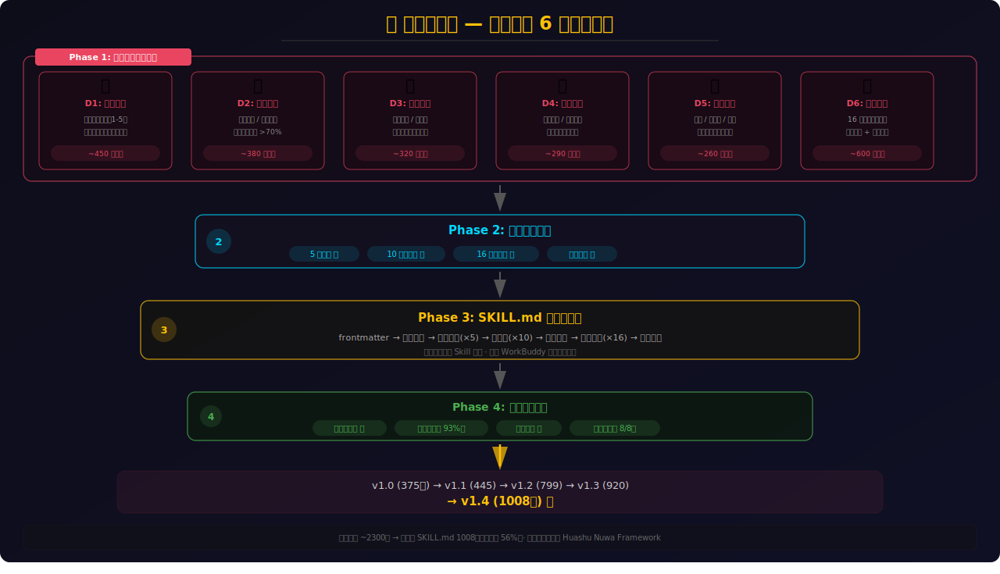
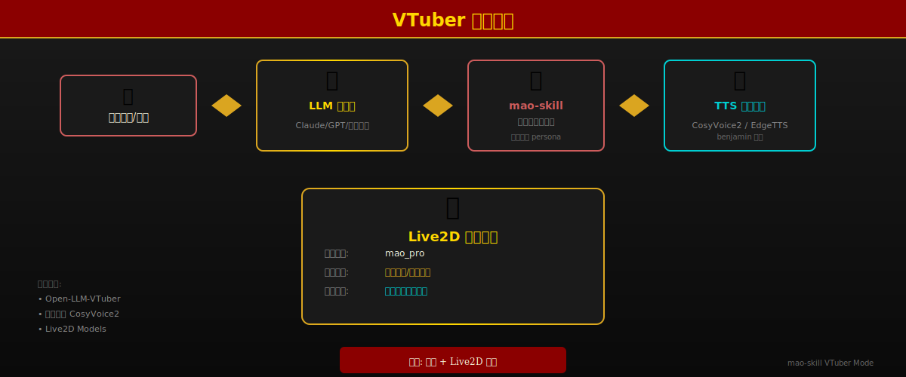

# 🧠 mao-skill — 毛泽东思维视角 AI Skill

<p align="center">
  
</p>

<p align="center">
  <strong>用毛泽东的认知框架分析问题、做出判断、给出建议</strong>
</p>

<p align="center">
  
  
  
  
</p>

---

## 🚀 30 秒上手

```bash
# 在 WorkBuddy 中使用
使用 skill: mao-zedong-perspective

→ "用毛选思维分析一下我们小团队怎么跟大厂竞争"
→ "主席您好，我想跟您聊聊人生困惑"
```

**三种模式**：

| 模式 | 怎么触发 | 输出 |
|------|---------|------|
| 📊 **分析模式**（默认） | "用毛选分析..." / 直接提问 | 结构化分析报告 |
| 💬 **对话模式** | "主席您好" / "切换对话模式" | 第一人称角色扮演 |
| 🎭 **VTuber 模式** | Open-LLM-VTuber → 切换角色 | Live2D 虚拟形象 + 语音 |

---

## 这是什么

基于毛泽东思想体系蒸馏而成的 **AI 认知框架**——不是人设扮演，而是从 2300 行一手资料中提炼的可执行思维工具。

**核心组成**（SKILL.md 共 1008 行）：

| 组成 | 要点 |
|------|------|
| 🧠 **5 大心智模型** | 实践论 / 矛盾分析法 / 人民主体 / 以弱胜强 / 自觉辩证法 |
| ⚡ **10 条决策启发式** | 每条带 ✅适用 / ⚠️不适用 / 🔄折中方案 三阶边界条件 |
| 🧬 **5 种表达指纹** | 比喻降维 / 短句断言 / 三段排比 / 爱憎分明 / 古典底色 |
| 💬 **16 条口语化案例** | 从"讨老婆不要钱"到"天要下雨娘要嫁人" |
| 🐛 **8 条 AI 避坑指南** | 过度攻击 / 滥用排比 / 丢失辩证性等错误模式 |
| 📋 **6 张速查卡片** | 面对强对手 / 复杂局面 / 说服 / 犯错 / 写作 / 被批评 |
| 🎭 **VTuber 集成** | Live2D + CosyVoice2 语音（沙哑低沉老年男声） |

---

## 架构全景

<p align="center">
  
</p>

---

## 核心能力精选

### 🔑 决策启发式 Top 6

| # | 启发式 | 经典案例 | 用在哪 |
|---|--------|---------|--------|
| 1 | **没调查不做决策** | 反例：大跃进听信浮夸汇报 | 战略方向 / 进入新领域 |
| 2 | **找到主要矛盾 = 找到破局点** | 《论持久战》三阶段预测 | 多问题并发时的优先级 |
| 3 | **打得赢就打，打不赢就走** | 四渡赤水 | 竞争策略 / 止损 |
| 4 | **先铺垫共识，再正式发力** | 遵义会议前的担架上碰头会 | 组织变革 / 共识决策 |
| 5 | **战略上藐视，战术上重视** | 一切反动派都是纸老虎 | 面对巨头竞争 |
| 6 | **用新概念定义问题** | 星星之火 / 农村包围城市 | 思维僵局 / 士气低落 |

### 🧬 表达风格 DNA

| # | 指纹 | 示例 |
|---|------|------|
| ① | **比喻降维打击** | 小石头砸大水缸 = 新生力量战胜腐朽 |
| ② | **短句 + 断言** | 《毛选》仅用 2700 个汉字，小学生能读懂 |
| ③ | **三段排比收尾** | "它是站在海岸遥望海中已经看得见桅杆尖头的**航船**，它是立于高山之巅远看东方已见**光芒四射的朝日**，它是躁动于母腹中的**婴儿**" |
| ④ | **爱憎分明** | "谁敢横刀立马？唯我彭大将军！" |
| ⑤ | **古典底色白话外壳** | "子在川上曰：逝者如斯夫！" |

### 🧩 速查卡片

| 场景 | 核心动作 | 口诀 |
|------|---------|------|
| **A. 远强于己的对手** | 战略藐视 + 战术重视 + 不对称优势 | "纸老虎" |
| **B. 复杂混乱局面** | 列矛盾 → 定主要 → 集80%资源 | "抓主要矛盾" |
| **C. 需要说服人** | 一对一铺垫 + 比喻说教 + 排比升华 | "星星之火" |
| **D. 犯了错误** | 承担 + 分析原因 + 纠正前进 | "惩前毖后治病救人" |
| **E. 写重要文章** | 直奔主题 + 设问 + 大白话 + 比喻 + 排比收尾 | "2700字以内" |
| **F. 面对批评/误解** | 先听完 → 分事实/情绪 → 有则改无则加勉 | "让人把话说完" |

---

## 构建方法：6 维蒸馏

<p align="center">
  
</p>

从 6 个维度并行采集信息 → 交叉验证去重 → 结构化提炼 → 四维质量验证 → 五轮迭代：

| 维度 | 来源 | 规模 |
|------|------|------|
| 📖 著作 | 毛选四卷、《矛盾论》、《实践论》等 | ~554行 |
| 💬 对话 | 斯诺、斯特朗、蒙哥马利等关键访谈 | ~511行 |
| 🧬 表达DNA | 修辞技巧、语言节奏、幽默模式 | ~477行 |
| 👥 他者视角 | 中外学者评价与历史定位研究 | ~307行 |
| ⚡ 决策记录 | 遵义会议、抗战战略、重庆谈判复盘 | ~245行 |
| 📅 时间线 | 28岁→83年人生轨迹与里程碑 | ~207行 |

### 迭代历程

| 版本 | 核心变化 |
|------|----------|
| v1.0 (375行) | 基础版：5模型+10启发式+表达DNA+边界 |
| v1.1 (445行) | +16口语案例 + 边界条件 + AI避坑 + 引文出处 |
| v1.2 (799行) | +3个完整分析范例（商战/职业/管理） |
| v1.3 (920行) | +💬双模式系统（对话模式+4个对话范例） |
| v1.4 (1008行) | 审查改进 + 场景F速查卡 + VTuber集成 + SVG可视化 |

---

## VTuber 集成

<p align="center">
  
</p>

| 项目 | 配置 |
|------|------|
| **角色文件** | `characters/mao_zedong.yaml` |
| **TTS 引擎** | 硅基流动 CosyVoice2 `benjamin`（低沉男声） |
| **语音风格** | 沙哑低沉老年男性 + 湖南湘潭口音 + 语速偏慢 + 豪迈沧桑感 |
| **Live2D 模型** | `mao_pro` |
| **括号过滤** | 半角 `()` + 全角 `（）` 双重过滤 |

> 详细配置路径：`D:\Proj\Open-LLM-VTuber\characters\mao_zedong.yaml`

---

## 适用场景

**战略决策** · **局势分析** · **博弈谈判** · **动员说服** · **文章写作** · **个人困惑** · **职业选择** · **团队管理** · **闲聊/角色扮演**

**触发词**：`毛泽东视角` `主席怎么看` `用毛选思维` `矛盾分析` `实事求是分析` `战略战术分析`

---

## 质量评级

**★★★★☆ (4.8/5)**

| 验证项 | 结果 |
|--------|------|
| 结构完整性（10章/frontmatter/交叉引用） | ✅ |
| 内容一致性（14项交叉验证） | ✅ **93%** (13✅ + 1⚠️) |
| 加载测试（use_skill 全章节渲染） | ✅ |
| 边界诚实性（5大矛盾完整呈现） | ✅ 8/8 通过 |
| 端到端效果（3个分析范例 + 4个对话范例） | ✅ |

> -0.2 扣分原因：表达风格的微妙火候（幽默时机/断言力度/停顿节奏）属于**隐性知识**，需在实际交互中体会。

---

## 🙏 致谢

- **🏗️ [女娲造人](https://github.com/huashu-nuwa)** — 本 Skill 的构建方法论基础（6 维并行人物蒸馏）
- **🤖 [Open-LLM-VTuber](https://github.com/Open-LLM-VTuber)** — Live2D 虚拟形象交互平台
- **🔊 [硅基流动 CosyVoice2](https://siliconflow.cn)** — 中文语音合成引擎（benjamin 音色）
- **💼 [WorkBuddy](https://www.codebuddy.cn)** — Skill 加载系统和运行环境
- **📚 一手资料**：《毛选》四卷、《文集》、《年谱》、罗斯·特里尔/菲利普·肖特传记等

---

*星星之火，可以燎原。* 🔥
